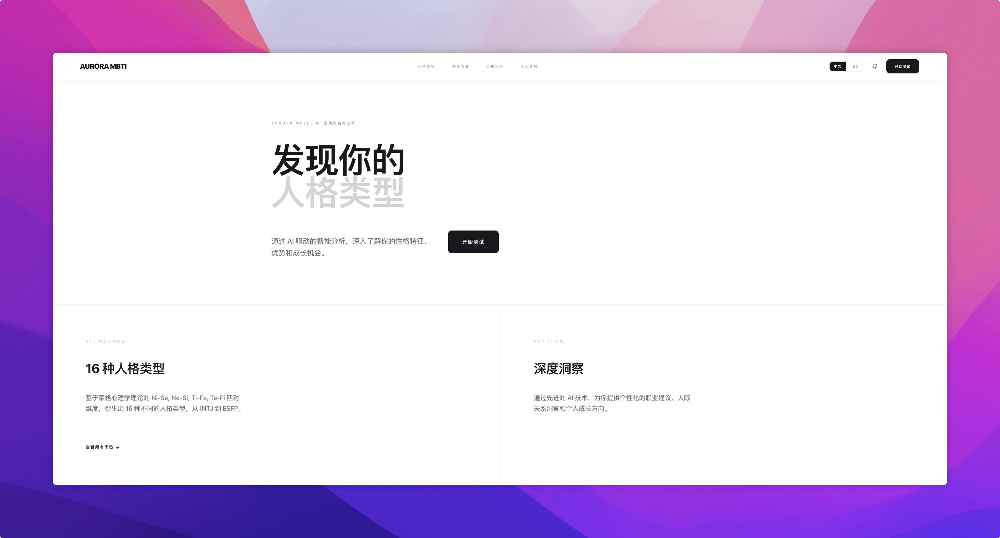

# Aurora MBTI - AI

一个基于 Next.js App Router 的 MBTI 测试与 AI 解读应用：支持测试、结果页、个人档案、历史记录，以及 AI 生成题目/分析（含流式输出）。

## 在线演示

- https://mbti.qunqin.net

## 功能

- MBTI 测试流程：题目、进度、结果页
- AI 解读：结构化输出 + 流式输出（SSE/Streaming）
- 个人档案：用于个性化追问与分析
- 多语言：`next-intl`（路由位于 `app/[locale]`）
- 本地存储：`localStorage`（保存档案/历史等）

## 技术栈

- Next.js 16 + React 19 + TypeScript（App Router）
- Tailwind CSS + shadcn/ui（Radix UI）
- Lucide React（图标）
- pnpm
- Docker / Docker Compose（可选）

## 快速开始（本地开发）

1) 安装依赖
```bash
pnpm install
```

2) 配置环境变量
```bash
cp env.template .env.local
```

3) 启动开发环境
```bash
pnpm dev
```

打开：`http://localhost:3000`

4) 本地检查（类型检查 + 构建）
```bash
pnpm lint
pnpm build
```

## 环境变量（OpenAI Compatible / 多提供方）

项目支持多提供方：OpenAI（Chat Completions / Responses）、Gemini、DeepSeek、OpenRouter、火山引擎（豆包）、阿里百炼（DashScope）、NewAPI、硅基流动、Ollama、Anthropic、Groq。  
**所有配置仅通过环境变量设置**，不提供前端设置页面。

### 统一入口变量（推荐）

- `AI_PROVIDER`：提供方标识（见下表）
- `AI_BASE_URL`：覆盖默认 Base URL（可留空）
- `AI_API_KEY`：统一 API Key（可留空，优先级低于提供方专用 Key）
- `AI_MODEL`：统一模型名（可留空）
- `CORS_ALLOWED_ORIGINS`：允许跨域来源（逗号分隔，默认仅同源）
- `DEBUG_API_LOGS`：调试日志开关（仅开发环境建议开启，默认关闭）

当 `AI_PROVIDER` 设置后，服务端会按该提供方读取**专用变量**并作为默认值。  
优先级：`AI_*`（显式） > 专用变量（如 `OPENROUTER_API_KEY`）> 内置默认值。

### 提供方与默认值

| AI_PROVIDER | 默认 Base URL | 默认模型 | 备注 |
|---|---|---|---|
| `openai` | `https://api.openai.com` | `gpt-4o-mini` | Chat Completions `/v1/chat/completions` |
| `openai-responses` | `https://api.openai.com` | `gpt-4o-mini` | Responses API `/v1/responses` |
| `gemini` | `https://generativelanguage.googleapis.com/v1beta` | `gemini-1.5-flash` | 使用 `key=` 查询参数 |
| `deepseek` | `https://api.deepseek.com` | `deepseek-chat` | OpenAI 兼容 |
| `openrouter` | `https://openrouter.ai/api/v1` | `openai/gpt-4o-mini` | OpenAI 兼容 |
| `volcengine` | `https://ark.cn-beijing.volces.com/api/v3` | `doubao-lite-32k` | OpenAI 兼容 |
| `bailian` | `https://dashscope.aliyuncs.com/compatible-mode/v1` | `qwen-plus` | OpenAI 兼容 |
| `newapi` | *(空)* | *(空)* | 需要自定义 Base URL |
| `siliconflow` | `https://api.siliconflow.cn/v1` | `Qwen/Qwen2.5-7B-Instruct` | OpenAI 兼容 |
| `ollama` | `http://localhost:11434` | `llama3.2` | 本地 Ollama |
| `anthropic` | `https://api.anthropic.com` | `claude-3-5-sonnet-latest` | Messages API `/v1/messages` |
| `groq` | `https://api.groq.com/openai/v1` | `llama-3.3-70b-versatile` | OpenAI 兼容 |

### 提供方专用环境变量

- **OpenAI / OpenAI Responses**
  - `OPENAI_API_KEY`、`OPENAI_API_URL`、`OPENAI_MODEL`
- **OpenRouter**
  - `OPENROUTER_API_KEY`、`OPENROUTER_BASE_URL`  
  - （可选）`OPENROUTER_SITE_URL`、`OPENROUTER_APP_NAME`（用于请求头）
- **Anthropic**
  - `ANTHROPIC_API_KEY`、`ANTHROPIC_BASE_URL`、`ANTHROPIC_VERSION`（默认 `2023-06-01`）
- **Gemini**
  - `GEMINI_API_KEY`、`GEMINI_BASE_URL`
- **DeepSeek**
  - `DEEPSEEK_API_KEY`、`DEEPSEEK_BASE_URL`
- **Groq**
  - `GROQ_API_KEY`、`GROQ_BASE_URL`
- **硅基流动**
  - `SILICONFLOW_API_KEY`、`SILICONFLOW_BASE_URL`
- **火山引擎（豆包）**
  - `VOLCENGINE_API_KEY`、`VOLCENGINE_BASE_URL`
- **阿里百炼（DashScope）**
  - `DASHSCOPE_API_KEY`、`DASHSCOPE_BASE_URL`
- **NewAPI**
  - `NEWAPI_API_KEY`、`NEWAPI_BASE_URL`
- **Ollama**
  - `OLLAMA_API_KEY`（可空）、`OLLAMA_BASE_URL`

### 常用配置示例

**1) OpenAI（Chat Completions）**
```env
AI_PROVIDER=openai
OPENAI_API_KEY=sk-xxxxxxxxxxxxxxxxx
OPENAI_API_URL=https://api.openai.com
OPENAI_MODEL=gpt-4o-mini
```

**2) OpenAI Responses**
```env
AI_PROVIDER=openai-responses
OPENAI_API_KEY=sk-xxxxxxxxxxxxxxxxx
OPENAI_API_URL=https://api.openai.com
OPENAI_MODEL=gpt-4o-mini
```

**3) OpenRouter**
```env
AI_PROVIDER=openrouter
OPENROUTER_API_KEY=or-xxxxxxxxxxxxxxxx
OPENROUTER_BASE_URL=https://openrouter.ai/api/v1
AI_MODEL=openai/gpt-4o-mini
OPENROUTER_SITE_URL=https://your-site.com
OPENROUTER_APP_NAME=Aurora-MBTI
```

**4) Gemini**
```env
AI_PROVIDER=gemini
GEMINI_API_KEY=AIzaSyxxxxxxxxxxxxxxxx
AI_MODEL=gemini-1.5-flash
```

**5) DeepSeek**
```env
AI_PROVIDER=deepseek
DEEPSEEK_API_KEY=xxxxxxxxxxxxxxxx
AI_MODEL=deepseek-chat
```

**6) Anthropic**
```env
AI_PROVIDER=anthropic
ANTHROPIC_API_KEY=sk-ant-xxxxxxxx
AI_MODEL=claude-3-5-sonnet-latest
ANTHROPIC_VERSION=2023-06-01
```

**7) NewAPI（必须自定义 Base URL）**
```env
AI_PROVIDER=newapi
NEWAPI_API_KEY=xxxxxxxxxxxxxxxx
NEWAPI_BASE_URL=https://your-newapi-domain/v1
AI_MODEL=gpt-4o-mini
```

**8) Ollama（本地）**
```env
AI_PROVIDER=ollama
OLLAMA_BASE_URL=http://localhost:11434
AI_MODEL=llama3.2
```

### env.template（完整）
```env
OPENAI_API_URL=https://api.openai.com
OPENAI_API_KEY=sk-xxxxxxxxxxxxxxxxx
OPENAI_MODEL=gpt-4o-mini
AI_PROVIDER=openai
AI_BASE_URL=
AI_API_KEY=
AI_MODEL=
OPENROUTER_API_KEY=
OPENROUTER_SITE_URL=
OPENROUTER_APP_NAME=
ANTHROPIC_API_KEY=
ANTHROPIC_VERSION=
GEMINI_API_KEY=
DEEPSEEK_API_KEY=
GROQ_API_KEY=
SILICONFLOW_API_KEY=
VOLCENGINE_API_KEY=
DASHSCOPE_API_KEY=
NEWAPI_API_KEY=
OLLAMA_API_KEY=
OPENROUTER_BASE_URL=
DEEPSEEK_BASE_URL=
GROQ_BASE_URL=
SILICONFLOW_BASE_URL=
VOLCENGINE_BASE_URL=
DASHSCOPE_BASE_URL=
NEWAPI_BASE_URL=
OLLAMA_BASE_URL=
ANTHROPIC_BASE_URL=
GEMINI_BASE_URL=
CORS_ALLOWED_ORIGINS=
DEBUG_API_LOGS=false
```

## API 路由

- `GET /api/health`：健康检查（AI 提供方与基础运行状态）
- `GET /api/debug/env`：调试环境变量（仅 `NODE_ENV!=production` 且 `DEBUG_API_LOGS=true`）
- `POST /api/generate-questions-*`：生成题目（结构化/流式/更稳健版本）
- `POST /api/generate-analysis-*`：生成分析（结构化/流式/更稳健版本）
- `POST /api/generate-profile-followups`：基于用户档案生成追问

## Docker（本地）

```bash
docker build -t aurora-mbti .
docker run -d -p 3000:3000 --name aurora-mbti \
  --env-file .env.local \
  aurora-mbti
```

## Docker（linux/amd64 构建与推送）

目标镜像：`qwq202/aurora-mbti-latest`

```bash
docker buildx build \
  --platform linux/amd64 \
  -t qwq202/aurora-mbti-latest:latest \
  --push .
```

## 云端部署（镜像方式）

```bash
docker pull qwq202/aurora-mbti-latest:latest
docker stop aurora-mbti || true
docker rm aurora-mbti || true
docker run -d --name aurora-mbti \
  -p 3000:3000 \
  --env-file .env.local \
  --restart unless-stopped \
  qwq202/aurora-mbti-latest:latest
```

## GitHub Release（v1.0.0）

```bash
git tag -a v1.0.0 -m "Release v1.0.0"
git push origin v1.0.0
gh release create v1.0.0 \
  --title "1.0" \
  --notes-file RELEASE_NOTES.md
```

如果不单独维护 `RELEASE_NOTES.md`，可改为：
```bash
gh release create v1.0.0 --title "1.0" --generate-notes
```

## 截图




