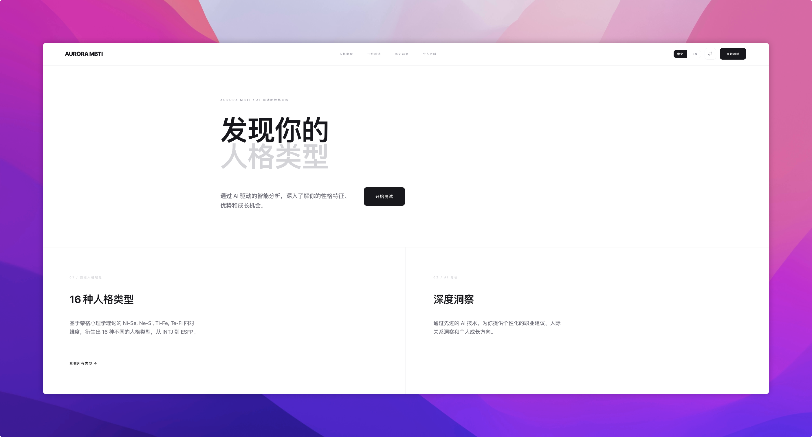

# Aurora MBTI - AI

一个基于 Next.js App Router 的 MBTI 测试与 AI 解读应用：支持测试、结果页、个人档案、历史记录，以及 AI 生成题目/分析（含流式输出）。

## 在线演示

- https://mbti.qunqin.net

## 功能

- MBTI 测试流程：题目、进度、结果页
- AI 解读：结构化输出 + 流式输出（SSE/Streaming）
- 个人档案：用于个性化追问与分析
- 多语言：`next-intl`（路由位于 `app/[locale]`）
- 本地存储：`localStorage`（保存档案/历史等）
- 后台控制台：`/[locale]/admin`（登录、运行状态、供应商连通测试）

## 技术栈

- Next.js 16 + React 19 + TypeScript（App Router）
- Tailwind CSS + shadcn/ui（Radix UI）
- Lucide React（图标）
- pnpm
- Docker / Docker Compose（可选）

## 快速开始（本地开发）

1) 安装依赖
```bash
pnpm install
```

2) 配置环境变量
```bash
cp env.template .env.local
```

3) 启动开发环境
```bash
pnpm dev
```

打开：`http://localhost:3000`

4) 本地检查（类型检查 + 构建）
```bash
pnpm lint
pnpm build
```

## 环境变量（OpenAI Compatible / 多提供方）

项目支持多提供方：OpenAI（Chat Completions / Responses）、Gemini、DeepSeek、OpenRouter、火山引擎（豆包）、阿里百炼（DashScope）、NewAPI、硅基流动、Ollama、Anthropic、Groq。

**AI 渠道配置**：可通过管理面板（`/[locale]/admin`）设置 Base URL、模型、API Key（加密存储），无需设置环境变量。环境变量仅用于不通过面板配置的选项。

### 统一入口变量（推荐）

- `CORS_ALLOWED_ORIGINS`：允许跨域来源（逗号分隔，默认仅同源）
- `DEBUG_API_LOGS`：调试日志开关（仅开发环境建议开启，默认关闭）
- `ADMIN_USERNAME`：后台登录用户名（必填）
- `ADMIN_PASSWORD`：后台登录密码（必填）

### 提供方与默认值

| AI_PROVIDER | 默认 Base URL | 默认模型 | 备注 |
|---|---|---|---|
| `openai` | `https://api.openai.com` | `gpt-4o-mini` | Chat Completions `/v1/chat/completions` |
| `openai-responses` | `https://api.openai.com` | `gpt-4o-mini` | Responses API `/v1/responses` |
| `gemini` | `https://generativelanguage.googleapis.com/v1beta` | `gemini-1.5-flash` | 使用 `key=` 查询参数 |
| `deepseek` | `https://api.deepseek.com` | `deepseek-chat` | OpenAI 兼容 |
| `openrouter` | `https://openrouter.ai/api/v1` | `openai/gpt-4o-mini` | OpenAI 兼容 |
| `volcengine` | `https://ark.cn-beijing.volces.com/api/v3` | `doubao-lite-32k` | OpenAI 兼容 |
| `bailian` | `https://dashscope.aliyuncs.com/compatible-mode/v1` | `qwen-plus` | OpenAI 兼容 |
| `newapi` | *(空)* | *(空)* | 需要自定义 Base URL |
| `siliconflow` | `https://api.siliconflow.cn/v1` | `Qwen/Qwen2.5-7B-Instruct` | OpenAI 兼容 |
| `ollama` | `http://localhost:11434` | `llama3.2` | 本地 Ollama |
| `anthropic` | `https://api.anthropic.com` | `claude-3-5-sonnet-latest` | Messages API `/v1/messages` |
| `groq` | `https://api.groq.com/openai/v1` | `llama-3.3-70b-versatile` | OpenAI 兼容 |

### 管理面板配置 AI 渠道
AI 渠道（Base URL、模型、API Key）可通过后台管理面板配置，API Key 使用 AES-256-GCM 加密存储。

配置路径：`/[locale]/admin` → 渠道管理

## API 路由

- 统一响应规范见：`docs/API.md`
- 版本前缀兼容：`/api/v1/*`（自动重写到 `/api/*`）
- `GET /api/health`：健康检查（AI 提供方与基础运行状态）
- `GET /api/debug/env`：调试环境变量（仅 `NODE_ENV!=production` 且 `DEBUG_API_LOGS=true`）
- `POST /api/generate-questions-*`：生成题目（结构化/流式/更稳健版本）
- `POST /api/generate-analysis-*`：生成分析（结构化/流式/更稳健版本）
- `POST /api/generate-profile-followups`：基于用户档案生成追问
- 普通用户接口启用匿名会话鉴权（自动下发 `aurora_anon_session`，无需登录）
- `POST /api/admin/login`：后台登录（设置 HttpOnly Cookie）
- `POST /api/admin/logout`：后台退出
- `GET /api/admin/overview`：后台概览数据（运行时、AI 配置、安全开关）
- `GET /api/admin/ai-config`：读取当前 AI 配置（含来源：panel/env）
- `POST /api/admin/ai-config`：保存 AI 配置到控制面板存储
- `POST /api/admin/provider-test`：按当前/指定 provider 执行连通测试
- `POST /api/auth/login`：已废弃（返回 `410`）
- `POST /api/auth/logout`：已废弃（返回 `410`）

## 后台控制台

后台页面路径：`/[locale]/admin`，视觉与信息架构参考了高星开源后台模板 **AdminLTE**（GitHub: `ColorlibHQ/AdminLTE`），并按本项目技术栈改为 Next.js + Tailwind 的实现。

**AI 渠道配置**：在后台控制台中配置 Base URL、模型、API Key（加密存储），无需重启服务。

## Docker（本地）

```bash
docker build -t aurora-mbti .
docker run -d -p 3000:3000 --name aurora-mbti \
  --env-file .env.local \
  aurora-mbti
```

## Docker（linux/amd64 构建与推送）

目标镜像：`qunqin45/aurora-mbti`

```bash
docker buildx build \
  --platform linux/amd64 \
  -t qunqin45/aurora-mbti:latest \
  --push .
```

## 云端部署（镜像方式）

```bash
docker pull qunqin45/aurora-mbti:latest
docker stop aurora-mbti || true
docker rm aurora-mbti || true
docker run -d --name aurora-mbti \
  -p 3000:3000 \
  --env-file .env.local \
  --restart unless-stopped \
  qunqin45/aurora-mbti:latest
```

## GitHub Release（v1.0.0）

```bash
git tag -a v1.0.0 -m "Release v1.0.0"
git push origin v1.0.0
gh release create v1.0.0 \
  --title "1.0" \
  --notes-file RELEASE_NOTES.md
```

如果不单独维护 `RELEASE_NOTES.md`，可改为：
```bash
gh release create v1.0.0 --title "1.0" --generate-notes
```

## 截图




